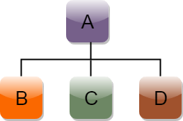
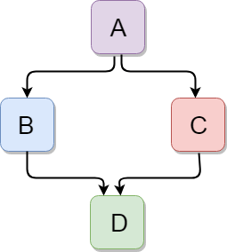

*INHERITANCE IS ALL ABOUT GRABING EVERYTHING FROM ONE CLASS TO ANOTHER*

 

- In C++, inheritance is a process in which one object acquires all the 
properties and behaviors of its parent object automatically. 
In such way, you can reuse, extend or modify the attributes and 
behaviors which are defined in other class.

- In C++, the class which inherits the members of another class is called derived class
and the class whose members are inherited is called base class. 
The derived class is the specialized class for the base class.

 

### **Advantage of C++ Inheritance**
Code reusability: Now you can reuse the members of your parent class. 
So, there is no need to define the member again. So less code is 
required in the class.

## Note:
- In C++, the default mode of visibility is private.

- The private members of the base class are never inherited.

- When the base class is privately inherited by the derived class, public members of the base class becomes the private members of the derived class. Therefore, the public members of the base class are not accessible by the objects of the derived class only by the member functions of the derived class.

- When the base class is publicly inherited by the derived class, public members of the base class also become the public members of the derived class. Therefore, the public members of the base class are accessible by the objects of the derived class as well as by the member functions of the base class.

 
 

## C++ supports five types of inheritance:

- Single inheritance
- Multiple inheritance
- Hierarchical inheritance
- Multilevel inheritance
- Hybrid inheritance

 
 
 

# **Single inheritance**

Single inheritance is defined as the inheritance in which a derived class is inherited from the only one base class.

 

 

		#include<bits/stdc++.h>
		using namespace std;

		// mother class is the base class

		// daughter class is the derived class

		class Mother {
		public:
			Mother();
			void sayName();

		};

		Mother::Mother() {    

		}

		void Mother::sayName() {
			cout << "hey you himangshu!!" << endl;

		}

		// here the daughter class is inherating everything from Mother class except the constructor.

		class Daughter: public Mother {

		public:
			Daughter();
		};
		Daughter::Daughter() {

		}

		int main() {

			Mother mom;
			mom.sayName();

			Daughter tina;
			tina.sayName();
		}

 
 
 

# HOW TO MAKE A PRIVATE MEMBER INHERITABLE

 
 

- The private member is not inheritable. If we modify the visibility mode by making it public, but this takes away the advantage of data hiding.

- C++ introduces a third visibility modifier, i.e., protected. The member which is declared as protected will be accessible to all the member functions within the class as well as the class immediately derived from it.

 
 
 

## **Visibility modes can be classified into three categories:**

 

- **Public:** When the member is declared as public, it is accessible to all the functions of the program.

- **Private:** When the member is declared as private, it is accessible within the class only.

- **Protected:** When the member is declared as protected, it is accessible within its own class as well as the class immediately derived from it.

 
 

# Multiple Inheritance

- Multiple inheritance is the process of deriving a new class that inherits the attributes from two or more classes.
 

 

	class D : visibility B-1 visibility B-2, .. 
	{  
		// Body of the class;  
	}   

 
 

# Multi-level Inheritance
 

	 When one class inherits another class which is further inherited by another class, it is known as multi level inheritance in C++. Inheritance is transitive so the last derived class acquires all the members of all its base classes.

 

 

 
 

# Hierarchical Inheritance
 

- Hierarchical inheritance is defined as the process of deriving more than one class from a base class.

 

 
 

	class A  
	{  
		// body of the class A.  
	}    
	class B : public A   
	{  
		// body of class B.  
	}  
	class C : public A  
	{  
		// body of class C.  
	}   
	class D : public A  
	{  
		// body of class D.  
	}   

 
 
 

# Hybrid Inheritance
 

- Hybrid inheritance is a combination of more than one type of inheritance.

 

 