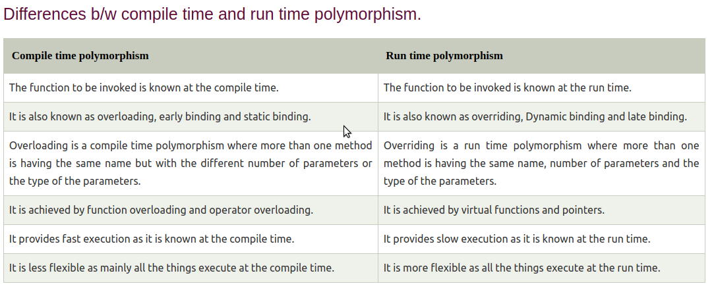

# C++ Polymorphism

- The term "Polymorphism" is the combination of "poly" + "morphs" which means many forms.
Polymorphism in C++ means, the same entity (function or object) behaves differently in different scenarios

 

# Real Life Example Of Polymorphism

        Let's consider a real-life example of polymorphism. A lady behaves like a teacher in a classroom, mother or daughter in a home and customer in a market. Here, a single person is behaving differently according to the situations.

  

# Types of polymorphism in C++

   

## **Compile time polymorphism:**

 - The overloaded functions are invoked by matching the type and number of arguments. 

 - This information is available at the compile time and, therefore, compiler selects the appropriate function at the compile time.

 - It is achieved by function overloading and operator overloading which is also known as static binding or early binding.

            class A                                  //  base class declaration.  
        {  
            int a;  
            public:  
            void display()  
            {   
                    cout<< "Class A ";  
                }  
        };  
        class B : public A                       //  derived class declaration.  
        {  
            int b;  
            public:  
        void display()  
        {  
                cout<<"Class B";  
        }  
        };  

In the above case, the prototype of display() function is the same in both the base and derived class. Therefore, the static binding cannot be applied. It would be great if the appropriate function is selected at the run time. This is known as run time polymorphism.

 
 

## Run Time Polymorphism :

- Run time polymorphism is achieved when the object's method is invoked at the run time instead of compile time. 

- It is achieved by method overriding which is also known as dynamic binding or late binding.

   

 
 

function overloading and method hiding 

function overloading --- is compile time 
method hiding -- run time 
 
both have same property like same name but different argument or parameter.

### only difference is that overloading is applicable only when both the method are in the same class

### when the method are from different class i.e inherited method hiding is applied.